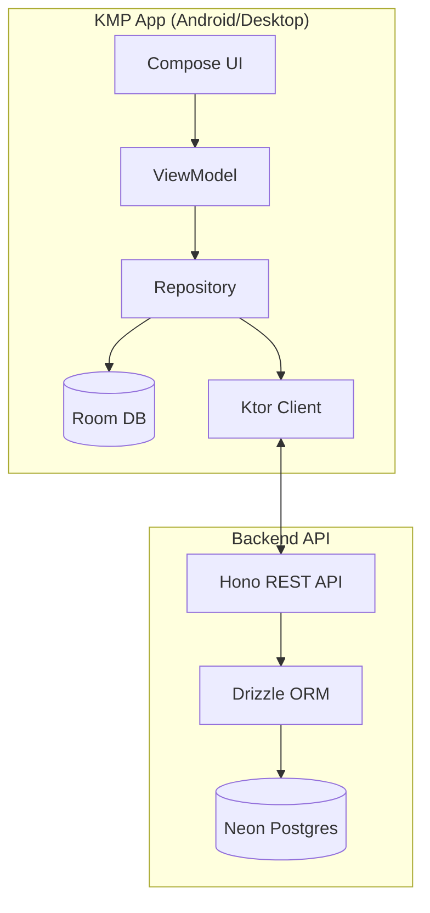

# Technical Architecture

## 1. High-Level Architecture

The application adopts a classic **Client-Server** model with a "Local-First" twist for the mobile client.

## 2. Tech Stack

### 2.1. Mobile/Desktop Client (KMP)
| Component | Technology | Reason |
| :--- | :--- | :--- |
| **Language** | Kotlin | Core requirement. |
| **UI Framework** | Compose Multiplatform | Shared UI for Android & Desktop. |
| **Navigation** | Voyager / Jetpack Navigation | Navigation management. |
| **DI** | Koin | Dependency Injection. |
| **Networking** | **Ktor Client** | Interacting with the Hono API. |
| **Local DB** | **Room** | Offline persistence and caching. |

### 2.2. Backend Server
| Component | Technology | Reason |
| :--- | :--- | :--- |
| **Runtime** | Node.js / Bun | Fast, ecosystem support. |
| **Framework** | **Hono** | Ultra-fast, lightweight web standard framework. |
| **Language** | **TypeScript** | Type safety shared with Drizzle. |
| **ORM** | **Drizzle ORM** | Type-safe, lightweight, SQL-like. |
| **Database** | **Neon (Postgres)** | Serverless Postgres. |
| **Auth** | API Key (Headers) | Simple security for V1. |

## 3. Data Layer Strategy

### 3.1. Local-First (Client)
*   **Source of Truth (UI):** The UI *always* observes the Local Room Database.
*   **Write Action:** User input -> Insert into Room (marked `isDirty = true`) -> Trigger Sync.

### 3.2. Sync Protocol (Client <-> Server)
*   **Auth:** All requests include `x-api-key` header.
*   **Push (Upload):**
    *   Client finds local records with `isDirty = true`.
    *   POST `/api/sync/push` with list of records.
    *   Server upserts (on conflict update).
    *   Client marks them `isDirty = false`.
*   **Pull (Download):**
    *   Client sends `GET /api/sync/pull?lastSyncedAt={timestamp}`.
    *   Server returns records modified since `{timestamp}`.
    *   Client upserts them locally.

## 4. Platform Specifics

### Android
*   **Camera:** CameraX + ML Kit for OCR.
*   **Background Work:** WorkManager for periodic background syncing.

### Desktop
*   **Camera:** File upload fallback.
*   **Windowing:** Compose for Desktop.
